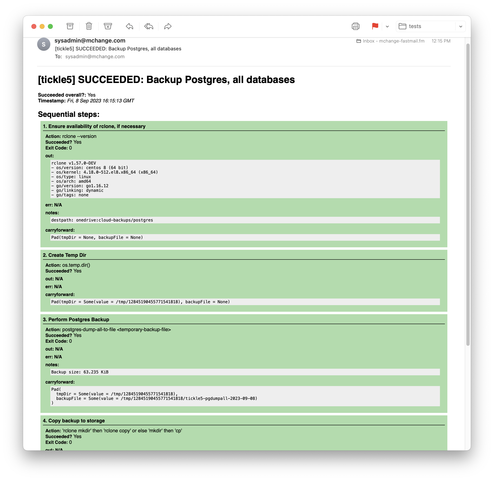

# mchange-sysadmin-scala

Some tools for doing sysadmin scripting in Scala

[](https://javadoc.io/doc/com.mchange/mchange-sysadmin-scala_3)

### Cautious tasks with reports

The main utility here is [`TaskRunner`](src/com/mchange/sysadmin/taskrunner/TaskRunner.scala). Developer docs are now [available](doc/TaskRunner-Developer-Guide.md).

The idea is you

* Define a "carryforward" or payload type to track state through the task.
  (You can use `Unit` if you don't need to track state)
* Define a sequence of steps that accept and pass forward your carryforward.
  Each step will be evaluated, and its exit code, out, err, etc. will be 
  included in reports. If all steps succeed, the overall task succeeds. If any step fails, later steps
  are skipped and the overall task fails. This list can be empty.
* Define a set of "best-effort setups", each attempted exactly once
  regardless of whether other setup steps have succeeded
  or failed. The setup steps are given the initial value of the carryforward,
  and their carryforward results are ignored. This list can be empty.
* Define a set of "best-effort followups", each attempted exactly once
  regardless of whether the main sequence or other followup steps have succeeded
  or failed. The followup steps are given the carryforward produced by the last
  unskipped task, and their carryforward results are ignored. This list can be empty.
  
In general only the sequential steps affect whether the task succeeds overall.
However, if you set the field `essential` to true on a nonsequential
(setup or followup) step, then failure of that step will cause the overall task
to fail.

When you run a task, you supply a list "reporters", which generate and send
reports about the run. SMTP, stdout, and stderr reporters are defined, though
of course you could define your own.

For example, [here](https://github.com/swaldman/mchange-sysadmin-scripts/blob/main/taskbin/renew-certs)
is a very simple task to renew letsencrypt certificates. The payload type is just `Unit`.

Here is a more complicated example that backs up a database and uploads the
results to an [rclone](https://rclone.org/) destination.

The task is defined
within an [abstract class](https://github.com/swaldman/mchange-sysadmin-scripts/blob/main/taskbin/backup-db-utils.scala), so it can be [trivially](https://github.com/swaldman/mchange-sysadmin-scripts/blob/main/taskbin/backup-postgres)
[specialized](https://github.com/swaldman/mchange-sysadmin-scripts/blob/main/taskbin/backup-mysql) for
multiple databases.

A bespoke case class `Pad` tracks the necessary state between steps. It retains
the temporary backup destination file, which is deleted in a followup step after 
the backup is uploaded or copied to its final destination.

In general, check out [mchange-sysadmin-scripts](https://github.com/swaldman/mchange-sysadmin-scripts), built on top of this library.

#### Example e-mailed report

Here's an example e-mail for a successfully executed task:



Here's a [PDF](doc/media/backup-postgres-succeeded.pdf) of that report, and the [same task failed](doc/media/backup-postgres-succeeded.pdf).

### Detailed text reports

Detailed text reports are also produced, in the logs (and as `text/plain` alternates in e-mail reports):

```plaintext
=====================================================================
 [because.lan] FAILED: Backup Postgres, all databases
=====================================================================
 Timestamp: 2023-09-08T10:17:50-04:00
 Succeeded overall? No

 SEQUENTIAL:
---------------------------------------------------------------------
 1. Ensure availability of rclone, if necessary
---------------------------------------------------------------------
 rclone --version
 Succeeded? Yes
 Exit code: 0

 out:
     rclone v1.63.1
     - os/version: darwin 13.5.1 (64 bit)
     - os/kernel: 22.6.0 (x86_64)
     - os/type: darwin
     - os/arch: amd64
     - go/version: go1.20.6
     - go/linking: dynamic
     - go/tags: none

 err:
     <empty>

 notes:
     destpath: onedrive:cloud-backups

 carryforward:
     Pad(tmpDir = None, backupFile = None)

---------------------------------------------------------------------
 2. Create Temp Dir
---------------------------------------------------------------------
 os.temp.dir()
 Succeeded? Yes

 out:
     <empty>

 err:
     <empty>

 carryforward:
     Pad(
       tmpDir = Some(value = /var/folders/by/35mx6ty94jng67n4kh2ps9tc0000gn/T/886556305491605568),
       backupFile = None
     )

---------------------------------------------------------------------
 3. Perform Postgres Backup
---------------------------------------------------------------------
 postgres-dump-all-to-file <temporary-backup-file>
 Succeeded? No
 Exit code: 1

 out:
     <empty>

 err:
     su: Sorry

 notes:
     Backup size: 0 bytes

 carryforward:
     Pad(
       tmpDir = Some(value = /var/folders/by/35mx6ty94jng67n4kh2ps9tc0000gn/T/886556305491605568),
       backupFile = Some(
         value = /var/folders/by/35mx6ty94jng67n4kh2ps9tc0000gn/T/886556305491605568/because.lan-pgdumpall-2023-09-08
       )
     )

---------------------------------------------------------------------
 4. Copy backup to storage
---------------------------------------------------------------------
 'rclone mkdir' then 'rclone copy' or else 'mkdir' then 'cp'
 Succeeded? No

 SKIPPED!

-+-+-+-+-+-+-+-+-+-+-+-+-+-+-+-+-+-+-+-+-+-+-+-+-+-+-+-+-+-+-+-+-+-+-

 BEST-EFFORT FOLLOWUPS:
---------------------------------------------------------------------
 Remove temporary local backup.
---------------------------------------------------------------------
 os.remove( <backup-file> )
 Succeeded? Yes

 out:
     <empty>

 err:
     <empty>

 carryforward:
     Pad(
       tmpDir = Some(value = /var/folders/by/35mx6ty94jng67n4kh2ps9tc0000gn/T/886556305491605568),
       backupFile = Some(
         value = /var/folders/by/35mx6ty94jng67n4kh2ps9tc0000gn/T/886556305491605568/because.lan-pgdumpall-2023-09-08
       )
     )

=====================================================================
.   .   .   .   .   .   .   .   .   .   .   .   .   .   .   .   .   .
```

## Other utilties

Includes some facilities to parse `nginx` logs.

## Dependencies

Dependency Javadocs:
* https://javadoc.io/doc/com.lihaoyi/pprint_3/latest/index.html
* https://javadoc.io/doc/com.lihaoyi/fansi_3/latest/index.html

Dependency References:
* https://com-lihaoyi.github.io/PPrint/
* https://www.lihaoyi.com/post/MicrooptimizingyourScalacode.html
